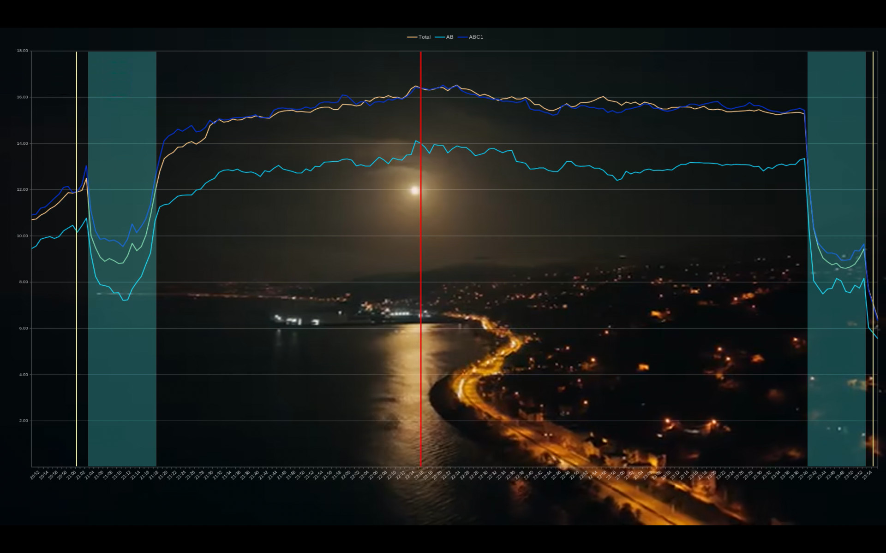

# Rating

## Required packages

```bash
apt-get install imagemagick bc
```

## Source video

```bash
EPISODE=1

ffmpeg -ss 00:00:05.0 -i tbd-$EPISODE-raw.mp4 \
  -vf "scale=1920:1080:flags=lanczos" -c:v libsvtav1 -movflags faststart \
  -c:a copy -y tbd-$EPISODE-1080.mp4
```

## Source graph

- Graph is a chart prepared by LibreOffice Calc using the rating data.
  - First, save as ODS, `minutes.ods`
  - Copy the sheet as 'rating', don't update the original sheet.
  - Don't remove the advertisement periods.
  - Start ~10 min earlier (select an even minute)
  - Stop after ~2 min (select an even minute)
- Create an empty sheet, `graph`
  - Insert chart
  - Line -> Lines only, Line type: smooth or straight
  - Data series in columns.
  - Display the legend at top
  - Make full screen with even numbers in X axis.
  - Put space between X axis and the bottom to make it visible all the time.
- Graph is captured by scrot while zooming (`ctrl+shift+j`) in Calc.
- Graph is a chart modified by GIMP.
  - It should have the same resolution with the source video, `1920x1080`
  - First, calculate PPS (pixel per second)
  - X axis should be shifted to the left by 30 seconds since the value of point
    is the average rating of the next minute.
  - Start and end time with color `#0815ca` (delete and fill)
  - Add advertisement periods by putting rectangle areas with color `#d9e303` on
    a layer with `50%` transparency.
  - Merge visible layers.
  - Inverted color.
  - Graph should be transparent, remove black area.

## Parameters

- `GRAPH` is the path of PNG file.
- `X0` is the pixel coordinate for starting point on X axis. Use minus 1 pixel
  because the vertical line's width is 2 pixels.
- `PPS` is the pixels per second.
  - Select a long range such as from 21:00 to 24:00
  - Get the pixel difference of these two points.
  - Calculate the pixels per second.
    `PPS = number_of_pixels / time_difference_as second`
  - Check `PPS` line in script and put correct values to calculate it.
- `Y0` is the pixel coordinate for top point of the slider on Y axis.
- `Y1` is the pixel coordinate for bottom point of the slider on Y axis.
- `SECONDS` is the length of the video (MP4 file) in seconds.
- `FRAMERATE` is the number of frames per second (default 0.5).
- Set `BREAKS`.

## Generating frames

```bash
deno run --allow-run --allow-read --allow-write graph-to-video.ts <GRAPH>
```

## Output Video

Watch `timer.mp4` before generating graph videos. Check if timer in graphic and
the actual timer match each others.

```bash
FRAMERATE=0.5
ffmpeg -r $FRAMERATE -i frames/%06d.png -vcodec h264 -y /tmp/timer.mp4

# Watch and check /tmp/timer.mp4
mpv /tmp/timer.mp4

ffmpeg -i source.mp4 -r $FRAMERATE -i frames/%06d.png \
  -filter_complex "overlay=0:0" -c:v libsvtav1 -movflags faststart \
  -y output/rating.mp4

# or

ffmpeg -i source.mp4 -r $FRAMERATE -i frames/%06d.png \
  -filter_complex "overlay=0:0" -c:v h264 -movflags faststart \
  -y output/rating.mp4
```

## Sample

A sample frame from video with a realtime embedded graph. The red line shows the
current position on the timeline.

[](images/frame.jpg)
